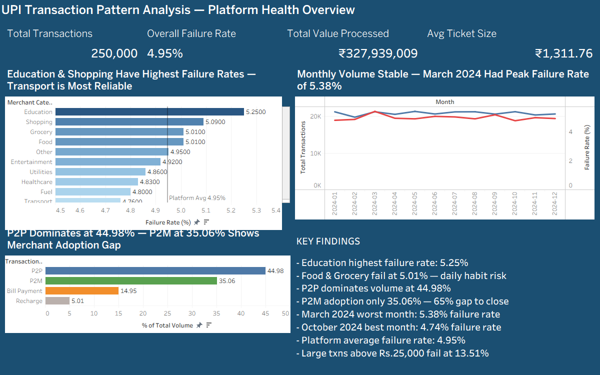
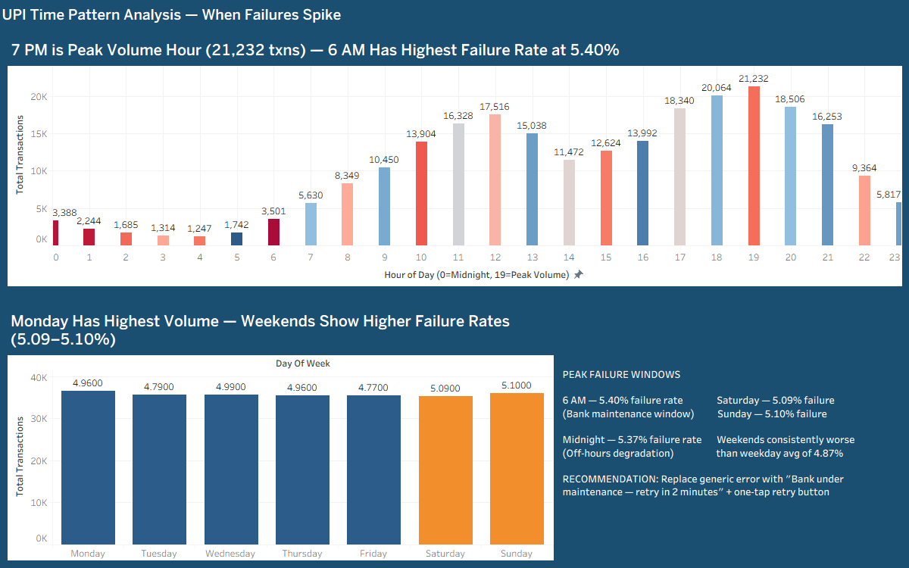
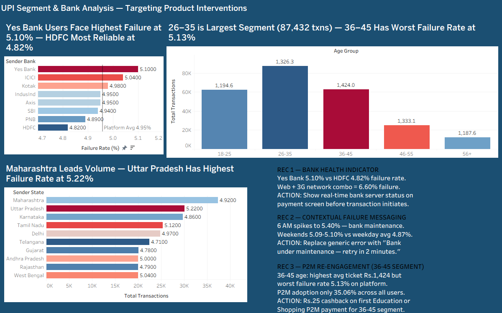

# UPI Transaction Pattern Analysis — Churn Signals & Product Recommendations

## Business Problem

A Bengaluru-based UPI payments app competing with PhonePe and GPay faces two critical problems:

1. **Transaction failures are killing trust** — At UPI's scale of 698 million daily
   transactions, even a 4.95% failure rate means millions of failed payments. Users who
   fail on your app but succeed on a competitor's switch and never return.
2. **P2M adoption is stalled** — Only 35.06% of transactions are merchant payments.
   65% of users are stuck in P2P-only behavior, limiting engagement and merchant revenue.

---

## Dataset

| Detail  | Value |
|---------|-------|
| **Rows** | 250,000 transactions |
| **Period** | January – December 2024 |
| **Columns** | 17 (transaction type, merchant category, amount, status, sender bank, device type, network type, age group, state, and more) |
| **Source** | Synthetically generated to simulate real UPI transaction patterns — inspired by NPCI and RBI market data. No real user data used. |
| **Kaggle** | [UPI Transactions 2024 Dataset](https://www.kaggle.com/datasets/skullagos5246/upi-transactions-2024-dataset) |

A 50-row sample is included in the `data/` folder to show the data structure.

---

## Approach

```
SQL Analysis (14 queries) → Excel Exploration → BRD Documentation → Tableau Dashboard → Product Recommendations
```

---

## Key Findings

| # | Finding |
|---|---------|
| 1 | **4.95% overall failure rate** — Education highest at 5.25%, Food & Grocery at 5.01% (daily habit risk) |
| 2 | **6 AM has highest failure rate at 5.40%** — bank maintenance window; 7 PM is peak volume (21,232 txns) |
| 3 | **Yes Bank users face 5.10% failure** vs HDFC at 4.82%; Web + 3G combination reaches 6.60% |
| 4 | **P2M adoption at only 35.06%** — 65% of transactions are non-merchant payments |
| 5 | **36–45 age group** has highest avg ticket ₹1,424 but worst failure rate 5.13% |
| 6 | **Maharashtra leads volume** (37,427 txns); Uttar Pradesh has highest failure rate at 5.22% |
| 7 | **Large transactions above ₹25,000 fail at 13.51%** — nearly 3× the platform average |
| 8 | **480 fraud-flagged transactions** — most common pattern: P2M + Shopping + 4G + Android |

---

## Product Recommendations

### REC 1 — Bank Health Indicator
> Yes Bank 5.10% vs HDFC 4.82% failure rate. Web + 3G network combo = 6.60% failure.

**Action:** Show real-time bank server status on the payment screen before a transaction
initiates. Flag 3G users to switch to WiFi.

---

### REC 2 — Contextual Failure Messaging
> 6 AM spikes to 5.40% — bank maintenance. Weekends 5.09–5.10% vs weekday avg 4.87%.

**Action:** Replace generic error messages with *"Bank under maintenance — retry in
2 minutes"* + one-tap retry button, triggered by hour and day failure patterns.

---

### REC 3 — P2M Re-engagement (36–45 Segment)
> 36–45 age group: highest avg ticket ₹1,424 but worst failure rate 5.13% on platform.
> P2M adoption only 35.06% across all users.

**Action:** ₹25 cashback on first Education or Shopping P2M payment for the 36–45 segment.

---

## SQL Queries

14 queries covering:

| Query | Coverage |
|-------|----------|
| 1  | Overall summary |
| 2  | Failure by transaction type |
| 3  | Failure by merchant category |
| 4  | Hourly failure patterns |
| 5  | Day-of-week patterns |
| 6  | Monthly trends |
| 7  | P2P vs P2M split |
| 8  | Value band distribution |
| 9  | Bank failure analysis |
| 10 | Device & network analysis |
| 11 | Age group behavior |
| 12 | Fraud pattern analysis |
| 13 | Geographic analysis |
| 14 | Behavioral segmentation |

---

## Project Files

```
UPI-Transaction-Pattern-Analysis/
│
├── data/
│   └── upi_sample_50rows.csv          # 50-row sample of the dataset
│
├── sql/
│   └── UPITransactionsPA.sql          # All 14 SQL queries
│
├── docs/
│   └── BRD_UPIChurnSignals_v1.0.pdf   # Business Requirements Document
│
└── dashboard/
    ├── dashboard_tab1_platform_health.png
    ├── dashboard_tab2_time_patterns.png
    └── dashboard_tab3_segments.png
```

### Dashboard Screenshots

**Tab 1 — Platform Health Overview**


**Tab 2 — Time Pattern Analysis**


**Tab 3 — Segment & Bank Analysis**


---

## Tools Used


`SQL Server Management Studio (SSMS)` · `Microsoft Excel` · `Tableau Public`

---

## Dataset Note

Dataset is synthetically generated to simulate real UPI transaction patterns while
preserving privacy compliance — inspired by NPCI and RBI market data. No real user
data is used in this analysis.

Raw dataset (250,000 rows) available at:
https://www.kaggle.com/datasets/skullagos5246/upi-transactions-2024-dataset
A 50-row sample is included in the `data/` folder to show the data structure.

---

